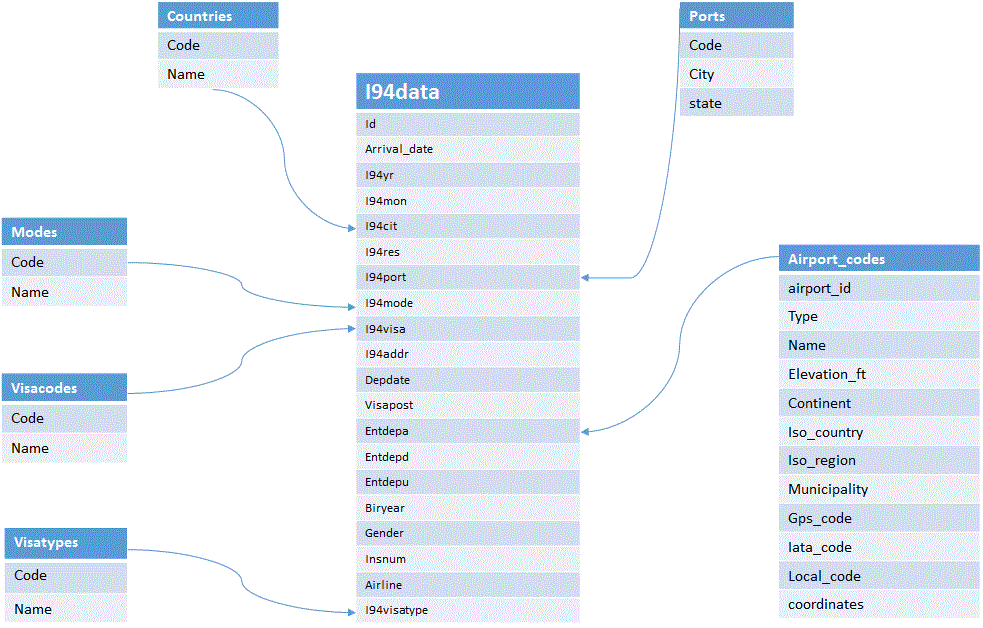

# Capstone project for Immigration data
 
 This capstone project involves processing INS immigration data along with supported dimension data.

# Background
 This Capstone project handles processing I94 data for Arrival and Departures into US thru various modes ( Air, Land and Sea ).  The information is collected upon arrival and stored in SAS file format. There are various static data elements needed to support i94 data like country information, country information, visa types , visa codes, modes.  Plus there is information on US demographics and airport codes also available for further processing.

## i94 Data
* I94YR - 4 digit year 
* I94MON - Numeric month 
* I94CIT & I94RES - This format shows all the valid and invalid codes for processing 
* I94PORT - This format shows all the valid and invalid codes for processing 
* ARRDATE is the Arrival Date in the USA. It is a SAS date numeric field that a
   permament format has not been applied.  Please apply whichever date format
   works for you. 
* I94MODE - There are missing values as well as not reported (9) 
* I94ADDR - There is lots of invalid codes in this variable and the list below
   shows what we have found to be valid, everything else goes into 'other' 
* DEPDATE is the Departure Date from the USA. It is a SAS date numeric field that
   a permament format has not been applied.  Please apply whichever date format
   works for you. 
* I94BIR - Age of Respondent in Years 
* I94VISA - Visa codes collapsed into three categories:
* COUNT - Used for summary statistics 
* DTADFILE - Character Date Field - Date added to I-94 Files - CIC does not use 
* VISAPOST - Department of State where where Visa was issued - CIC does not use 
* OCCUP - Occupation that will be performed in U.S. - CIC does not use 
* ENTDEPA - Arrival Flag - admitted or paroled into the U.S. - CIC does not use 
* ENTDEPD - Departure Flag - Departed, lost I-94 or is deceased - CIC does not use 
* ENTDEPU - Update Flag - Either apprehended, overstayed, adjusted to perm residence - CIC does not use 
* MATFLAG - Match flag - Match of arrival and departure records 
* BIRYEAR - 4 digit year of birth 
* DTADDTO - Character Date Field - Date to which admitted to U.S. (allowed to stay until) - CIC does not use 
* GENDER - Non-immigrant sex 
* INSNUM - INS number 
* AIRLINE - Airline used to arrive in U.S. 
* ADMNUM - Admission Number 
* FLTNO - Flight number of Airline used to arrive in U.S. 
* VISATYPE - Class of admission legally admitting the non-immigrant to temporarily stay in U.S. 

# Approach
The processing of data is split into multiple phases

## Phase I
Parse the SAS file defintions and extract all dimension data. These are
* Countries
* Ports
* VisaTypes
* VisaCodes
* Modes

The data is extracted and stored as csv files.

## Phase II
Process SAS files based on SAS file defintion, clean up the file by removing any nulls, format date into correct format and save them as parquet file partition by year and month.

### Phase III
Join i94 fact data and static dimension data to create necessary queries and save the result into parquet formats.

I94 Data can be uploaded monthly as parquet files are overwritten and are partitioned by year/month, any new data will be added as separate directory for futher processing.

## Database structure

# Further Enhancements / Scalability Considerations

## What if data is incresed by 100x.

Run the elt jobs on large distributed clusters such as Mesos / Yarn and submit job to spark cluster.

Store the input / output data in distributed file systems such as S3 or HDFS

## If the pipelines were run on a daily basis by 7am.

Create Apache Airflow pipelines to submit spark jobs in evening and another pipefile to to populate dashboard by 7am.

## If the database needed to be accessed by 100+ people.

The current approach does not use database but output files which can be read by many people. Given below is much better approach for scalability

# Alternate approach for scalability/performance

The below approach is preferred solution for performance and scalability.

Process i94 data as described above and create parquet files.  Once the parquet files are created, move them S3.  Create RedShift database to mirror immigration schema for Fact and Dimension tables.  Load parquet data from S3 into RedShift using COPY command.  Write airflow operators or custom SQL to extract data from Redshift into Analytics or Reporting database.

